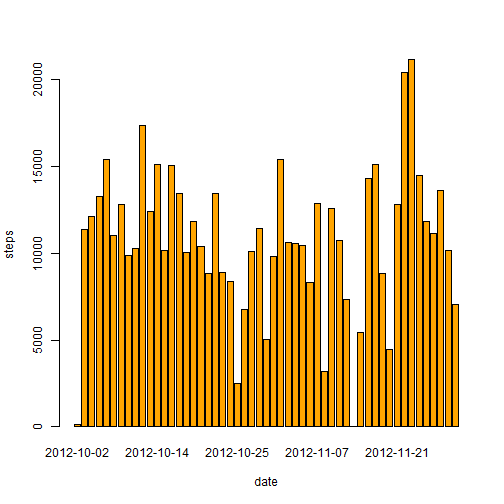
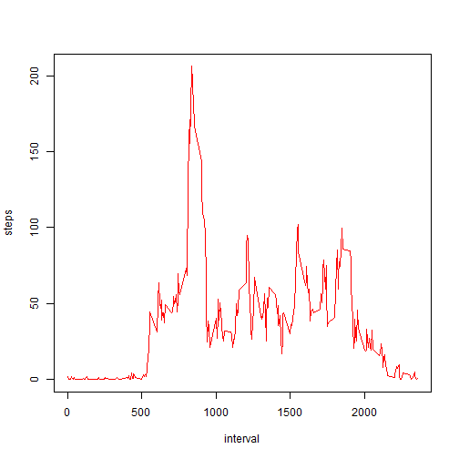
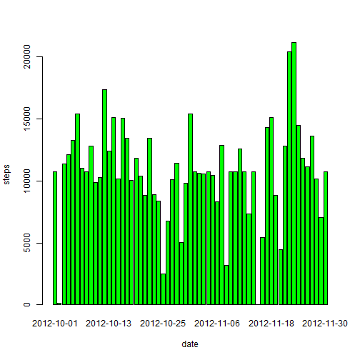
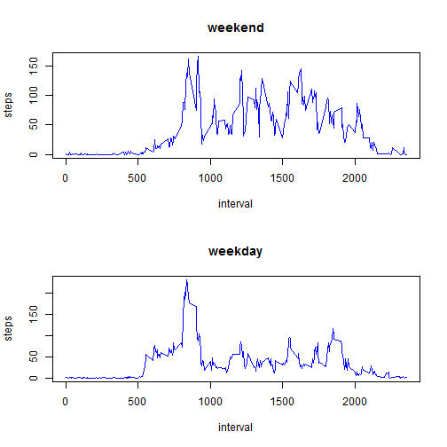

```r
library (plyr)
library (lattice)
```

## Loading and preprocessing the data


```r
activity <- read.csv("activity.csv")
```


## What is mean total number of steps taken per day?


```r
stepsperday <- aggregate(steps ~ date, data=activity, FUN=sum)
barplot(stepsperday$steps, names.arg=stepsperday$date, xlab="date", ylab="steps", col = "orange")
```

 


```r
mean(stepsperday$steps)
```

```
## [1] 10766.19
```

```r
median(stepsperday$steps)
```

```
## [1] 10765
```

## What is the average daily activity pattern?


```r
stepsperinterval <- aggregate(steps ~ interval, data=activity, FUN=mean)
plot(stepsperinterval, type="l", col = "red")
```

 


```r
stepsperinterval$interval[which.max(stepsperinterval$steps)]
```

```
## [1] 835
```


## Imputing missing values


```r
sum(is.na(activity))
```

```
## [1] 2304
```


```r
activity <- merge(activity, stepsperinterval, by="interval", suffixes=c("",".y"))
nas <- is.na(activity$steps)
activity$steps[nas] <- activity$steps.y[nas]
activity <- activity[,c(1:3)]
```


```r
stepsperdate <- aggregate(steps ~ date, data=activity, FUN=sum)
barplot(stepsperdate$steps, names.arg=stepsperdate$date, xlab="date", ylab="steps", col = "green")
```

 

```r
mean(stepsperdate$steps)
```

```
## [1] 10766.19
```

```r
median(stepsperdate$steps)
```

```
## [1] 10766.19
```

## Are there differences in activity patterns between weekdays and weekends?


```r
daytype <- function(date) {
    if (weekdays(as.Date(date)) %in% c("Saturday", "Sunday")) {
        "weekend"
    } else {
        "weekday"
    }
}
activity$daytype <- as.factor(sapply(activity$date, daytype))
```


```r
par(mfrow=c(2,1))
for (type in c("weekend", "weekday")) {
    stepspertype <- aggregate(steps ~ interval,
                            data=activity,
                            subset=activity$daytype==type,
                            FUN=mean)
    plot(stepspertype, type="l", main=type, col = "blue")
}
```

 
